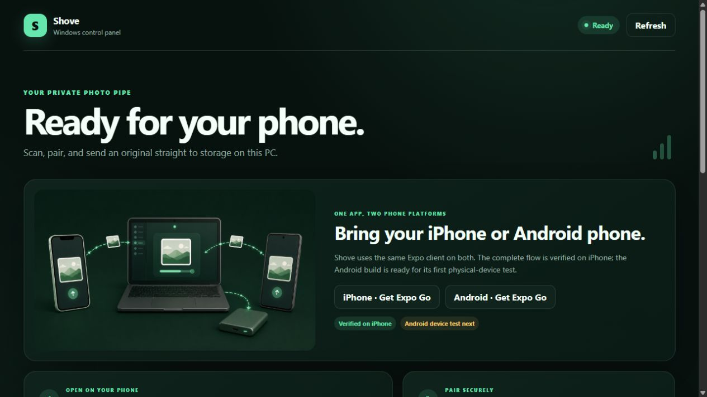

# Shove

## Try Shove on Windows

> **Current status: working source preview, not yet a self-contained installer.** The new setup window removes terminal interaction, but the laptop must currently have Java 21, Maven, Node.js 20.19+, and pnpm 10 installed. Docker and WSL are not required.



*The local Windows control panel: connect through Expo Go, pair once, and send originals to the PC or an attached drive.*

The shortest working path is:

1. Put this repository in a normal Windows folder.
2. Install **Expo Go** on the phone and connect it and the laptop to the same trusted home Wi-Fi.
3. Double-click **`Open Shove.cmd`**.
4. Choose the Windows folder and optional external SSD in the setup window.
5. Leave **Allow my phone to reach Shove** selected and personally approve the Windows permission prompt.
6. When preparation finishes, select **Open Shove**.
7. Scan the QR, create a pairing code, and send one photo.

On later runs, double-click **`Open Shove.cmd`** again. It starts the saved configuration and opens the control panel. Use **`Shove Settings.cmd`** to change storage. The source-preview setup may take several minutes the first time while it builds the server and prepares the mobile project.

Read the [easy Windows usage guide](docs/windows-usage-guide.md) for prerequisites, screenshots-to-expect, the first transfer, and simple troubleshooting.

> **Friend-ready installer: next milestone.** Friends install only Shove on Windows and Expo Go on their phone. Shove will carry small private Java and Node/Metro runtimes, reuse or repair its own files, and leave any developer tools untouched. Maven and pnpm will not be installed for customers. See the [customer-alpha acceptance criteria](docs/customer-alpha.md).

Terminal commands and APIs are retained for development and troubleshooting, but are not the intended onboarding path.

Repository: **`shove-it`**

Documentation: [docs index](docs/README.md) · [architecture](docs/architecture.md) · [flows and data](docs/flows-and-data.md) · [design decisions](docs/decisions/README.md) · [Windows usage guide](docs/windows-usage-guide.md)

> Shove your photos home.

Shove is a privacy-first, self-hosted photo offload system. It sends full-resolution photos and videos from a phone to a Windows or macOS computer—and to storage attached to that computer—without routing the library through a commercial cloud.

**Status:** weekend prototype with the first phone-to-Windows transfer verified on an iPhone 13 mini. The shared Expo client is intended to remain Android-compatible, but Android hardware has not yet been tested. `Shove` is a working name, not a final brand decision.

## Proven vertical slice

On 2026-08-15, an iPhone 13 mini running the Expo Go client paired with the Java server on a Windows laptop over local Wi-Fi and transferred an original HEIC photo successfully.

- The phone reported `Verified on Windows` for all 1,338,827 bytes.
- Java streamed the request to a `.part` file, flushed it, calculated SHA-256, and atomically promoted it.
- The resulting Windows file hash was `6b45ea5ae50ab87cad75be89513b35d53ebcfd16b35392242ac8f0d92a0d6453`.
- No `.part` file remained after completion.
- Pairing, bearer-token authentication, and reconnectable secure token storage were exercised in the same test.

This proves the V1 foreground pipeline. It does not yet prove interrupted-transfer recovery, multi-gigabyte video behavior, or native iOS background execution.

The same hardware was subsequently used to verify the complete pairing/audit lifecycle: the original device authenticated and uploaded, self-unpair set its `last_seen_at` and `revoked_at`, re-pairing created a distinct active device ID, and the next upload referenced that new ID. The SQLite upload rows survived server restarts, all recorded byte counts and SHA-256 values matched the files on disk, and no `.part` files remained.

The configured storage root was also proven on a Samsung T7 Shield external SSD formatted exFAT. Java wrote a real iPhone original beneath `E:\Shove`, the independent disk hash and size matched SQLite, atomic promotion succeeded, and the previous default root received no duplicate.

## Product decision: native client first

The primary client is a React Native app built with Expo. React Native owns the product UI and orchestration; platform-native code owns durable transfers. A web uploader may later become a fallback or recovery surface, but it is not the primary product.

We are taking the native-client path because the product depends on phone-side behaviour:

- a visible upload queue with per-item state;
- photo-library access and original metadata;
- progress, retry, and cancellation;
- secure device pairing and credential storage;
- a future path to background transfer and guided cleanup.

A Safari upload form proves that HTTP can carry a file, but not that Shove can be a dependable phone-storage tool. Expo Go lets us validate selection, pairing, API compatibility, and foreground transfer from a Windows laptop. It cannot host Shove's custom native transfer module; background-transfer validation moves to an EAS-built development client. A distributable iOS build will later use EAS Build or a Mac/Xcode toolchain.

## Problem and promise

People with 64 GB and 128 GB phones repeatedly perform manual storage cleanup. Existing solutions often require a subscription, upload more than the user intended, or require technical NAS administration.

Shove should make personal storage feel like an appliance:

1. Run Shove on the home computer.
2. Pair the phone once.
3. Select what should leave the phone.
4. See unambiguous proof that every original reached home intact.
5. Remove verified items from the phone when ready.

The promise is simple: **free space on your phone; keep the originals at home.**

## Product principles

1. **Local first.** The home computer is the destination; no cloud account is required.
2. **Originals are sacred.** Preserve original bytes and useful source metadata.
3. **Never imply safety without verification.** A file is safe only after the server persists it and verifies its digest.
4. **Deletion is explicit.** The prototype never automatically deletes from the phone.
5. **Secure by default.** Devices pair explicitly; the server is not exposed to the public internet.
6. **Boring storage.** Photos remain normal files in a user-controlled directory.
7. **Recoverable transfers.** Interrupted uploads retry or resume; partial files never appear as completed originals.

## Immediate goal: prove the pipe

V1 is not a React Native or Expo architecture exercise. Its sole purpose is to prove that an original selected on a phone can cross the home Wi-Fi network, land on the Windows laptop, be verified, and produce a trustworthy acknowledgement on the phone.

The first working slice is intentionally disposable around the edges. We keep one narrow `TransferEngine` interface so a native implementation can replace the foreground adapter later, but we do not build a custom Expo module, background scheduler, elaborate state framework, or production navigation for this slice.

## Weekend prototype

The first prototype proves one complete local-network journey:

```text
Windows server starts
        |
        v
User chooses a storage directory
        |
        v
Phone pairs with a short-lived code / QR payload
        |
        v
User selects a photo or video
        |
        v
Foreground prototype uploads with visible progress
        |
        v
Server persists and verifies each original
        |
        v
Phone reports verified; Windows audit records the result
```

### Pipeline must have

- Java server runs on the Windows laptop and is reachable over local Wi-Fi.
- Expo app runs on a phone through Expo Go; the proven device is an iPhone 13 mini.
- User can select an original photo or video.
- The foreground client uploads the selected file to a manually entered laptop address.
- The client shows uploading, verifying, complete, or failed state.
- Server writes to a temporary file and atomically promotes a successful upload.
- Server calculates SHA-256 and records the verified result.
- The final bytes, size, and digest can be inspected on the laptop.
- The first slice remains compatible with Android while retaining the verified iPhone path.

### Next only after the pipe works

- Multiple-item queue and durable local task metadata
- Duplicate detection
- Pairing management and device revocation UI
- SQLite transfer history (paired-device credentials are already persisted)
- Chunking/resume protocol
- Dashboard and library browser
- Native iOS background transfer adapter

### Explicitly deferred

- Automatic photo discovery/sync (native background execution of user-queued transfers is part of the target architecture)
- Automatic deletion from the phone
- Remote access outside the home network
- End-to-end encrypted remote transport
- Albums, face recognition, search, and editing
- Multi-user households
- Docker distribution, licensing, subscriptions, and paywalls
- App Store/TestFlight distribution
- Production certificate lifecycle and automatic LAN discovery

## High-level architecture

```text
+----------------------+       local Wi-Fi       +---------------------------+
| Phone client         |  -------------------->  | Shove server              |
| React Native / Expo  |       authenticated     | Java 21 / Spring Boot     |
|                      |       HTTP uploads       |                           |
| - pairing            |                          | - pairing/auth            |
| - media picker       |                          | - resumable upload API    |
| - queue UI/state     |                          | - integrity verification  |
| - native transfer   |                          |                           |
|   engine             |                          |                           |
| - transfer history   |                          | - dashboard/API           |
+----------------------+                          +-------------+-------------+
                                                                  |
                                                   +--------------+-------------+
                                                   |                            |
                                                   v                            v
                                            +-------------+              +-------------+
                                            | SQLite     |              | Originals   |
                                            | metadata   |              | filesystem  |
                                            +-------------+              +-------------+
```

## Components

### `apps/mobile`

The phone-facing Expo application. Its current foreground path is shared by iOS and Android; physical end-to-end verification has so far been performed only on iPhone.

- **Implemented:** manual server address, short-code pairing, secure token storage, photo/video picker, one foreground transfer with progress, verified result, and self-unpair.
- **Proposed:** QR pairing, durable multi-item queue, retry/cancel UX, activity history, and broader settings.

### Native transfer-engine boundary

Transfer reliability is **not** designed around a JavaScript timer, loop, or a React component remaining alive.

- TypeScript calls a narrow `TransferEngine` interface to enqueue a file-backed upload, cancel it, and query/reconcile task state.
- On iOS, the production implementation is a Swift Expo module backed by a background `URLSession` configuration and file-based upload tasks.
- The operating system owns execution after enqueueing, including while the app is suspended or terminated subject to iOS rules.
- Native code persists the mapping between Shove upload IDs and platform task identifiers before scheduling work.
- Native delegates write progress and terminal results into a durable native event/state store.
- React Native observes events while active and performs a full reconciliation on launch/resume; missed JS events are therefore harmless.
- The Java server supports idempotent session creation, explicit offsets, and completion reconciliation so retries do not produce extra library items.

The scaffold includes a minimal foreground implementation for Expo Go so we can exercise the end-to-end protocol immediately. It is a development adapter, not the reliability model. The native iOS adapter will replace it behind the same interface in an EAS development build after the pipe is proven.

An iOS background upload must reference a stable file URL. Selected PhotoKit assets therefore need to be exported into app-controlled staging storage before being handed to the native transfer engine. Staged files remain until the server acknowledges verified completion and native task reconciliation has recorded it.

### `server`

A Java 21 Spring Boot process that:

- serves the JSON API and, later, an embedded dashboard;
- owns pairing, authentication, upload sessions, and verification;
- stores metadata through JDBC in SQLite;
- writes media beneath an explicitly configured storage root;
- treats external drives as configured roots instead of embedding OS-specific drive discovery in the core.

The server code is organized by product capability (`server`, and later `pairing`, `upload`, and `library`) rather than by global controller/service/repository layers.

## Target resumable data flow (proposed)

The implemented whole-file flow is documented precisely in [flows and data](docs/flows-and-data.md). The following is the later resumable direction and is not implemented:

1. Client requests an upload session with source filename, media type, byte size, capture time, and client asset identifier.
2. Server returns an upload ID and accepted offset.
3. Client sends authenticated chunks bound to that upload ID.
4. Server writes to `<storage>/.shove/incoming/<upload-id>.part`.
5. On completion, the server flushes the file and calculates SHA-256.
6. Server compares the digest with the client digest when the client can provide one.
7. Server atomically moves the file into the library and commits its record.
8. Only then does the client show **Verified at home**.

The initial storage layout remains understandable without Shove:

```text
<storage-root>/
  Shove Library/
    2026/
      08/
        <stable-id>_<original-filename>
```

The stable prefix prevents collisions while retaining the original filename. Partial files remain outside the library and can be cleaned safely.

## Pairing and security

The prototype is LAN-only but still authenticated.

1. Server creates a short-lived, single-use pairing secret.
2. QR payload contains protocol version, server URL, server identity, and secret.
3. Phone exchanges the secret for a random device token.
4. Server stores only a hash of the device token.
5. Every upload and metadata request authenticates with that token.
6. Server binds to the private network intentionally and displays reachable addresses.

The first prototype may use HTTP on a trusted home LAN because provisioning a locally trusted iOS certificate is non-trivial. This is a documented prototype limitation—not the production security posture. Transport must be encrypted and the server identity authenticated before supporting untrusted networks.

Security invariants:

- Never accept an absolute destination path from a client.
- Never construct a path directly from an uploaded filename.
- Apply upload count, file-size, and request-time limits.
- Treat MIME labels as hints and inspect signatures before promotion.
- Never log pairing secrets or device tokens.
- Expire pairing secrets quickly and reject reuse.
- Keep the server independent of public-network and cloud services.

## API evolution

The diagnostic slice uses `GET /healthz`, `GET /api/v1/server`, and `POST /api/v1/dev/uploads`. The development upload route accepts a raw request body plus `X-Shove-Filename`, is present only under Spring's `dev` profile, and still passes through `DeviceAuthenticator`. The first real slice adds a six-digit, two-minute pairing code, a durable bearer token, and an authenticated whole-file upload. The remaining routes describe the later target protocol and must not block the initial end-to-end test.

Routes are provisional and versioned under `/api/v1`.

| Method | Route | Purpose |
| --- | --- | --- |
| `GET` | `/healthz` | Process and storage health |
| `GET` | `/api/v1/server` | Server identity and capabilities |
| `POST` | `/api/v1/dev/uploads` | V0 raw streaming upload; `dev` profile only |
| `POST` | `/api/v1/pair` | Exchange a short-lived code for a device token |
| `POST` | `/api/v1/upload` | Authenticated V0 raw streaming upload |
| `GET` | `/api/v1/uploads` | Authenticated history for the calling device |
| `GET` | `/api/v1/uploads/{id}` | Authenticated status, scoped to the owning device |
| `POST` | `/api/v1/pairing/sessions` | Create a short-lived pairing session |
| `GET` | `/api/v1/devices` | List paired devices; laptop loopback only |
| `DELETE` | `/api/v1/devices/{id}` | Revoke a paired device; laptop loopback only |
| `DELETE` | `/api/v1/device` | Authenticated device revokes its own token |
| `PUT` | `/api/v1/device/status` | Authenticated foreground device reports validated platform and storage telemetry |
| `GET` | `/api/v1/destinations` | List approved storage choices and live availability |
| `GET` | `/api/v1/admin/uploads` | List the complete upload audit; laptop loopback only |
| `GET` | `/api/v1/admin/overview` | Control-panel connectivity and live destination status; laptop loopback only |
| `GET` | `/api/v1/admin/expo-qr.svg` | QR for the current physical Wi-Fi Expo address; laptop loopback only |
| `POST` | `/api/v1/pairing/claim` | Exchange a secret for device credentials |
| `POST` | `/api/v1/uploads` | Create or resume an upload session |
| `PATCH` | `/api/v1/uploads/{id}` | Append a chunk at an expected offset |
| `POST` | `/api/v1/uploads/{id}/complete` | Finalize and verify an upload |
| `GET` | `/api/v1/uploads` | Return transfer history and status |
| `GET` | `/api/v1/library` | Return verified library items |

## Core records

### Device

- ID and display name
- Device-token hash
- Paired, last-seen, and revoked timestamps

### Upload

- Upload ID, device ID, and source asset ID
- Original filename, media type, size, and capture timestamp
- Current offset and lifecycle state
- Temporary path, final relative path, and SHA-256 digest
- Created, updated, and completed timestamps

These device and upload records are persisted in SQLite. Upload ownership checks ensure one paired device cannot request another device's receipt by ID. Audit recording begins with the server version that introduced the `uploads` table; files transferred by older builds are not assigned retroactive device identities.

### Library item

- Stable ID and source upload ID
- Final relative path and verified size/digest
- Original metadata
- Imported timestamp

## Repository layout

```text
.
|-- apps/
|   `-- mobile/       # Expo / React Native phone client
|-- docs/             # Architecture, decisions, verification, and usage
|-- scripts/          # Windows prototype helpers
|-- server/           # Java 21 / Spring Boot home server
|-- shove.cmd         # Setup/start/status/pair/firewall/stop entry point
|-- shove.ps1         # Managed Windows development launcher
|-- pair.cmd          # Pairing-code popup/CLI entry point
|-- .editorconfig
|-- .gitignore
`-- README.md
```

## Prerequisites

### Windows laptop

- Git
- Java 21 and Maven 3.6.3+
- Node.js 20.19+ and pnpm
- Laptop and phone connected to the same Wi-Fi network

### Phone

- Expo Go from the phone's app store
- Photos permission for the Shove development client

## Getting started

```powershell
cd D:\Shove-it
.\shove.cmd setup
.\shove.cmd start
```

`setup` asks for the local library and optional external SSD, checks prerequisites, packages Java, installs the locked mobile dependencies, and saves non-secret developer configuration under ignored `.shove-dev`. With explicit consent, it also asks Windows for administrator approval and creates home-subnet-only firewall rules. `start` launches Java and Expo/Metro in the background, waits for both to become healthy, injects the current physical Wi-Fi server address into the phone bundle, and opens the local control panel.

```powershell
.\shove.cmd status
.\shove.cmd pair
.\shove.cmd firewall
.\shove.cmd stop
```

The server defaults to port `8787`, stores its SQLite audit at `server/shove.db`, and preserves configuration, audit history, and originals when stopped. The launcher never silently installs system prerequisites or opens firewall ports; firewall changes require both an affirmative setup choice and a Windows UAC approval.

Firewall actions and their resulting narrow rule scopes are recorded at `.shove-dev\logs\firewall.log` for troubleshooting.

### First phone transfer

1. Configure and start the development prototype:

   ```powershell
   cd D:\Shove-it
   .\shove.cmd setup
   .\shove.cmd start
   ```

2. In the control panel opened by `start`, scan the Expo Go QR and select **Create pairing code**. The code is single-use and has a live two-minute countdown. The popup and terminal helper remain available as a fallback:

   ```powershell
   .\shove.cmd pair -Cli
   ```

   Pairing sessions can be created only from the laptop's loopback interface, so another device on the LAN cannot mint its own code.

3. On a clean Expo Go install, the Windows launcher supplies the current phone server URL automatically. Connect and enter the six-digit code. An address saved by an earlier prototype session remains available for reconnecting.

4. Choose one photo or video. A successful response means the server flushed the `.part` file, calculated SHA-256, atomically moved it into `Shove Library/<year>/<month>`, and returned the verification receipt.

If firewall setup was skipped or the home subnet changed, run `.\shove.cmd firewall` and approve the Windows prompt. The rules accept traffic only from the detected local subnet. Remove only Shove-managed rules with `.\shove.cmd firewall -Remove`.

For the exact firewall scope, phone connectivity check, safe rule removal, and customer-release requirements, see the [Windows local-network usage guide](docs/windows-usage-guide.md).

## Two-day build order

### Day 1: one-file vertical slice

1. Server health endpoint and storage-root validation
2. Mobile shell, tiny `TransferEngine` boundary, and manual server address
3. Select and upload one original file in the foreground
4. Write `.part`, calculate SHA-256, and atomically promote it
5. Show the verified result on the phone and inspect the file on Windows

### Day 2: harden the proven pipe

1. Repeat with mixed photos and videos
2. Add a small sequential multi-file queue and retry
3. Add idempotency and basic duplicate handling
4. Test an external-drive destination and interrupted transfer
5. Record protocol findings that shape the later native background adapter

## Acceptance test

The first milestone succeeds when a full-resolution photo and a large video selected on a phone arrive intact on the Windows laptop, their server-calculated SHA-256 digests are returned to the phone, and the source photo library remains untouched. This milestone is verified on an iPhone 13 mini; Android remains unverified. The weekend stretch goal is a small mixed batch with retry and no duplicate final files.

## Open decisions after the prototype

- Final product/company name
- Native Swift versus continued React Native client
- Native iOS `URLSession` module details, scheduling policy, and staging quotas
- Local TLS and server-identity strategy
- Remote access design
- Windows/macOS packaging and updates
- Open-source boundary and commercial feature model
