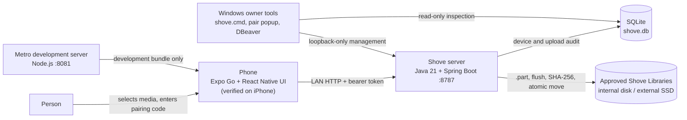
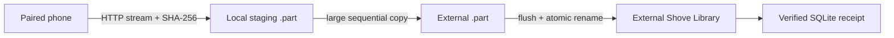
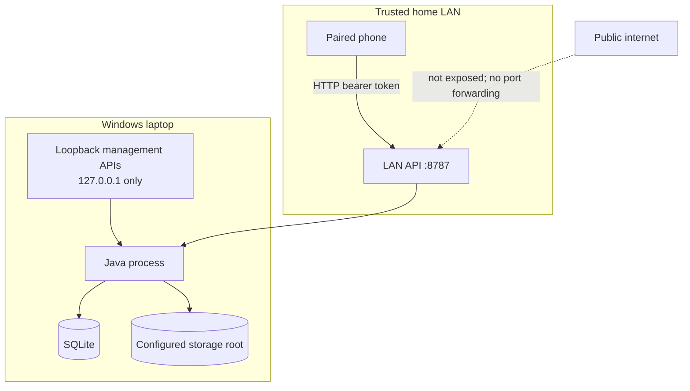
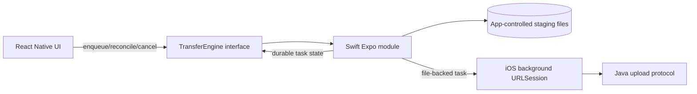

# Architecture

**Status:** Current architecture is implemented. The native iOS background adapter described later is proposed.

## Objective

Shove moves a user-selected original from a phone to user-controlled Windows storage over the local network and reports success only after Java has persisted and verified the file. The current path is verified on iPhone and remains open for Android testing.

The current vertical slice optimizes for learning about the transfer pipeline, not for distribution or visual completeness.

## Implemented system context



There is no Shove cloud service in this path. Metro is required only because the prototype runs through Expo Go; distributed mobile applications will not need port `8081`.

## Components

### Mobile application

Location: `apps/mobile`

Implemented responsibilities:

- enter and verify the laptop URL;
- claim a short-lived pairing code;
- store the bearer token in platform secure storage through Expo SecureStore;
- retrieve the server-approved storage destinations and refresh their availability every two seconds while the app is active;
- choose a destination by opaque ID without sending a Windows path;
- select an image or video through the system picker;
- enqueue a foreground file upload through `TransferEngine`;
- show progress and server-verified completion;
- revoke and forget the current device pairing.

The UI does not calculate the authoritative digest. The Java response is authoritative for the current prototype.

### Transfer-engine seam

Location: `apps/mobile/src/transfers`

`TransferEngine` separates product UI/orchestration from the mechanism that owns a transfer. The current `ExpoGoTransferEngine` uses Expo FileSystem and works only while the development runtime can execute it.

This seam exists so the foreground adapter can later be replaced without redesigning the screens or server protocol.

### Java server

Location: `server`

Implemented responsibilities:

- health and server discovery information;
- short-lived, single-use pairing sessions;
- bearer-token authentication;
- paired-device persistence, last-seen tracking, and revocation;
- streaming request bodies without multipart buffering;
- SHA-256 calculation while writing;
- exact request-length validation;
- atomic promotion from incoming storage into the library;
- persistent upload audit and per-device ownership checks;
- an allow-listed destination registry with live writable/connected status;
- upload routing by server-owned destination ID;
- loopback-only device management and complete audit views.

### SQLite

Default path: `server/shove.db`

SQLite stores paired-device and upload audit metadata. It does not store media bytes. The raw bearer token is never stored; only its SHA-256 hash is persisted.

### Filesystem library

Default root: `server/.shove-data`. An optional second root can be registered with `SHOVE_EXTERNAL_STORAGE_ROOT`.

The configured root contains an internal incoming area and a human-readable library:

```text
<storage-root>/
  .shove/
    incoming/
      <upload-id>.part
  Shove Library/
    <year>/
      <month>/
        <upload-id>_<original-filename>
```

Each registered root has the same layout. The upload ID prevents collisions while retaining the original filename. Partial files never appear in `Shove Library` as completed originals. The phone selects only the opaque IDs `local` or `external`; it cannot submit a Windows path.

Local uploads stream directly into the local incoming area. External uploads first stream into a local staging part and are then copied sequentially to the selected drive's incoming area. Java flushes and atomically promotes the external part before reporting success. This keeps memory bounded and avoids coupling the phone's HTTP receive loop to pathological removable-drive write latency observed with the T7's exFAT filesystem.



## Trust boundaries



Current HTTP traffic is not encrypted. The prototype is safe only for a trusted private LAN with narrowly scoped Windows firewall rules and no router port forwarding. Production support for hostile, public, or remote networks requires authenticated server identity and encrypted transport.

## Implemented API surface

| Method | Route | Caller and purpose |
| --- | --- | --- |
| `GET` | `/healthz` | LAN-readable process/storage health |
| `GET` | `/api/v1/server` | LAN-readable server identity and capabilities |
| `POST` | `/api/v1/pairing/sessions` | Loopback only; create a two-minute code |
| `POST` | `/api/v1/pair` | LAN; exchange a code for device ID/token |
| `DELETE` | `/api/v1/device` | Authenticated phone revokes itself |
| `PUT` | `/api/v1/device/status` | Authenticated foreground phone reports validated platform and storage telemetry |
| `GET` | `/api/v1/destinations` | Authenticated phone lists approved destinations and current availability |
| `POST` | `/api/v1/upload` | Authenticated whole-file streaming upload |
| `GET` | `/api/v1/uploads` | Authenticated history for the calling device |
| `GET` | `/api/v1/uploads/{id}` | Authenticated receipt owned by the calling device |
| `GET` | `/api/v1/devices` | Loopback only; list paired devices |
| `DELETE` | `/api/v1/devices/{id}` | Loopback only; revoke a device |
| `GET` | `/api/v1/admin/uploads` | Loopback only; complete upload audit |
| `GET` | `/api/v1/admin/overview` | Loopback only; control-panel readiness and destinations |
| `GET` | `/api/v1/admin/expo-qr.svg` | Loopback only; locally generated Expo Go QR |
| `POST` | `/api/v1/dev/uploads` | Development profile only; deliberate authentication bypass for plumbing tests |

The whole-file endpoint is intentionally simple. Resumable sessions, explicit offsets, and idempotent completion are deferred until interruption tests provide concrete protocol requirements.

## Target native-transfer architecture

**Proposed, not implemented:**



The operating system—not a JavaScript timer or React component—must own background execution. React Native will observe and reconcile native durable state when active.

## Deployment boundary

Current development deployment:

- `shove.cmd` provides setup, managed Java/Metro lifecycle, health/status, pairing, logs, phone-address injection, and automatic control-panel launch.
- Non-secret developer configuration and runtime records live under ignored `.shove-dev`.
- Java runs from the packaged Spring Boot JAR; Metro remains development-only.
- The repository and default media directory are on the Windows filesystem, not inside WSL.
- The phone and laptop use the same Wi-Fi subnet.
- Windows firewall rules permit only Java `8787` and development Node `8081` from the home subnet.

Customer packaging is deferred. The local admin surface is implemented; the package must now include private Java and Node/Metro runtimes, check/repair its own small manifest, manage startup and narrow firewall access, and leave system developer tools untouched. Maven and pnpm remain build-only.
