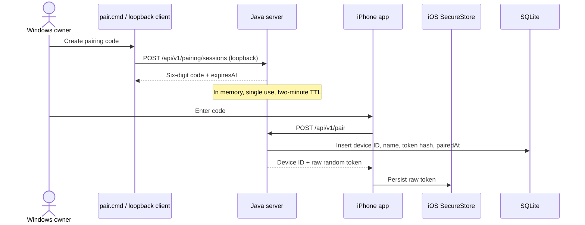
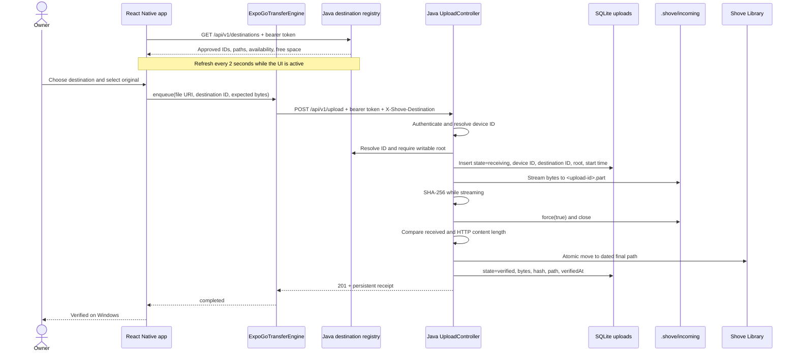
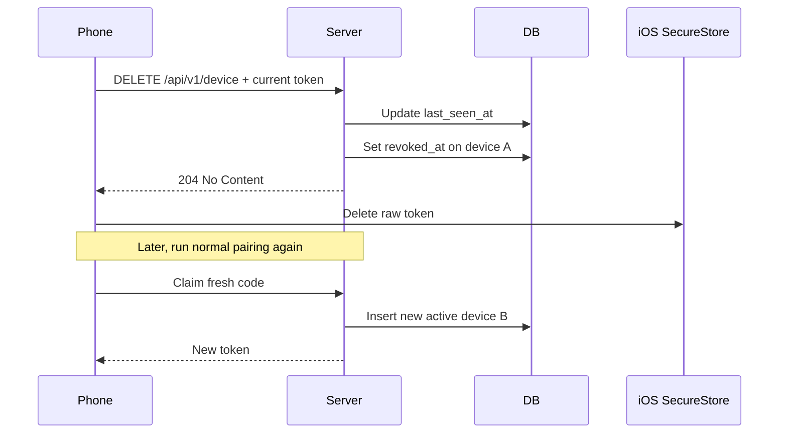
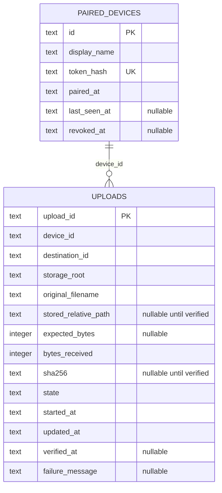

# Flows and data

**Status:** The flows and tables below are implemented and were exercised on the prototype unless marked otherwise.

## Pairing

Controls:

- Pairing sessions can be minted only through loopback.
- Codes are removed when claimed and rejected after expiration.
- Device tokens contain 32 random bytes and are returned only once.
- SQLite stores `SHA-256(token)`, not the raw token.
- Upload authentication hashes the presented token and accepts only a matching, non-revoked device.

## Verified upload

The success label is shown only after the server has flushed, hashed, promoted, and persisted the verified audit record.

On a handled write, length, promotion, or persistence failure, Java attempts to delete the `.part` file and marks the audit row `failed` with an update time and bounded failure message.

One crash-consistency gap remains explicit: if the atomic move succeeds and the following SQLite verified-state update fails, the final file may exist while the audit row becomes failed. Likewise, an abrupt process termination can leave an audit row in `receiving`. Reconciliation and orphan recovery are deferred until interruption testing defines the required behavior.

## Unpair and re-pair

Revocation is non-destructive. Device A remains in the database so existing upload rows retain their correct historical owner. Re-pairing creates device B even when its display name is the same.

## Data model

SQLite timestamps are stored as ISO-8601 UTC strings. Media files remain ordinary filesystem files; SQLite stores only identity, ownership, destination, lifecycle, integrity, and path metadata. Older upload rows are migrated with destination ID `legacy` rather than being falsely attributed to a new configured root.

The current schema does not declare a database foreign-key constraint from `uploads.device_id` because the development bypass records a synthetic development device ID. Application code still records and enforces real paired-device ownership on the authenticated route.

## Ownership rules

- `POST /api/v1/upload` attributes the new record to the authenticated device ID.
- The upload header contains an opaque destination ID; Java resolves it through its allow-list and rejects unknown or disconnected targets.
- `GET /api/v1/uploads` filters by the authenticated device ID.
- `GET /api/v1/uploads/{id}` returns a receipt only when its device ID matches the caller.
- Loopback administrators may view all device and upload rows.
- Revocation blocks future authentication but preserves previous audit history and media.

## Integrity meaning

`verified=true` currently means:

1. Java consumed the request body.
2. Received bytes matched the declared HTTP content length when known.
3. Java calculated SHA-256 over exactly the bytes written.
4. The file channel was forced to storage and closed.
5. The storage provider completed an atomic move into the final library path.
6. SQLite persisted the verified state, path, size, hash, and timestamps.

It does not yet mean that the phone independently calculated and compared a source digest. Client-side digest comparison is a later hardening option.
